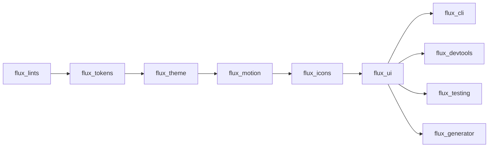

# Flux UI — Release Process

## Release Types

| Type | When | Approval |
|------|------|----------|
| Patch release | Bug fix, docs, security | 1 reviewer |
| Minor release | New feature, preview promotion | 2 reviewers + lead |
| Major release | Breaking changes | 3 reviewers + lead + community notice |
| Hotfix | Critical security or crash fix | Lead approval, direct to main |

## Pre-release Checklist

- [ ] All issues in the milestone are closed
- [ ] All PRs for the release are merged to `dev`
- [ ] `melos run analyze` passes on `dev`
- [ ] `melos run test` passes on `dev`
- [ ] `melos run test:goldens` passes on `dev`
- [ ] `melos run check:architecture` passes
- [ ] `melos run check:dependencies` passes
- [ ] All packages build successfully
- [ ] Example app builds and runs
- [ ] No unresolved `FIXME` or `TODO` comments in changed files
- [ ] CHANGELOG.md files are up to date
- [ ] Migration guide is written (major releases only)
- [ ] Version numbers are updated in all packages

## Release Steps

### 1. Create Release Branch

```bash
git checkout dev
git pull origin dev
git checkout -b release/v1.1.0
```

### 2. Update Versions

```bash
# Update all package versions in sync
melos version --version 1.1.0

# Or manually update pubspec.yaml files
# Verify with:
melos run check:dependencies
```

### 3. Update Changelogs

Update `CHANGELOG.md` for each package following [Keep a Changelog](https://keepachangelog.com/):

```markdown
## [1.1.0] - 2026-06-15

### Added
- FluxSlider component (#42)

### Changed
- ...
```

### 4. Run Full Validation

```bash
melos run validate  # runs: analyze, format:check, test, test:goldens, build
```

### 5. Create Pull Request

Open PR from `release/v1.1.0` → `main`:

- Title: `chore(release): v1.1.0`
- Body: include changelog summary
- Labels: `release`, `priority: high`

### 6. Code Review

- Architecture team reviews changelog and version bumps
- Lead approves the final release
- No code changes on release branch (except version/changelog)

### 7. Merge to Main

```bash
git checkout main
git merge release/v1.1.0
git tag v1.1.0
git push origin main --tags
```

### 8. Publish to pub.dev

```bash
# Publish each package in dependency order (via CI or manually)
cd packages/flux_tokens && flutter pub publish
cd packages/flux_theme && flutter pub publish
cd packages/flux_motion && flutter pub publish
cd packages/flux_icons && flutter pub publish
cd packages/flux_lints && flutter pub publish
cd packages/flux_ui && flutter pub publish
```

Or use the automated CI workflow:

```bash
# Push tag triggers CI release workflow
git push origin v1.1.0
```

### 9. Publish GitHub Release

```bash
gh release create v1.1.0 \
  --title "Flux UI v1.1.0" \
  --notes "See [CHANGELOG](CHANGELOG.md) for full details." \
  --target main
```

### 10. Merge Back to Dev

```bash
git checkout dev
git merge main
git push origin dev
```

### 11. Post-Release

- [ ] Announce on GitHub Discussions
- [ ] Update documentation website (if applicable)
- [ ] Monitor pub.dev metrics
- [ ] Create milestone for next release

## Hotfix Process

For critical bugs in a released version:

```bash
git checkout main
git checkout -b hotfix/crash-on-empty-input
# fix the bug
git commit -m "fix(ui): crash on empty FluxTextField input"
git checkout main
git merge hotfix/crash-on-empty-input
git tag v1.0.1
git push origin main --tags
# Publish
```

Hotfix PRs must be reviewed by at least 1 maintainer. After publishing, merge the hotfix back to `dev`:

```bash
git checkout dev
git merge main
```

## CI Automation

### Release Trigger

```yaml
# .github/workflows/release.yml
on:
  push:
    tags:
      - 'v*'

jobs:
  validate:
    runs-on: ubuntu-latest
    steps:
      - uses: actions/checkout@v4
      - uses: subosito/flutter-action@v2
        with:
          flutter-version: '3.24.x'
      - run: melos bootstrap
      - run: melos run analyze
      - run: melos run test
      - run: melos run build

  publish:
    needs: validate
    runs-on: ubuntu-latest
    steps:
      - run: melos run publish:all
        env:
          PUB_CREDENTIALS: ${{ secrets.PUB_CREDENTIALS }}
```

## Package Publishing Order



Dependencies flow left to right. `flux_lints` has no dependencies — publishable first.
